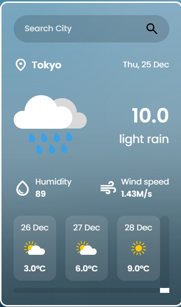

# 🌦️ Weather Forecast App (Flask + Redis + Docker)

A lightweight and high-performance weather web application that provides current weather conditions and a 3-day forecast. This project demonstrates integration with external APIs, data caching strategies, and containerization.

## 🚀 Key Features
* **Real-time Weather**: Displays temperature, humidity, wind speed, and weather conditions.
* **3-Day Forecast**: Smart data filtering to show the forecast for the next three days at noon.
* **Efficient Caching**: Uses Redis to store city data for 30 minutes (TTL 1800s), reducing API calls and improving response times.
* **Dynamic UI**: Beautiful interface with weather-dependent icons and a clean, modern design.
* **Error Handling**: Custom "City Not Found" states and input validation.

## 🛠 Tech Stack
* **Backend**: Python 3.x, Flask
* **Caching**: Redis
* **Containerization**: Docker & Docker Compose
* **API**: [OpenWeatherMap](https://openweathermap.org/api) (5 Day / 3 Hour Forecast)
* **Frontend**: HTML5, CSS3, Jinja2 Templates

## 📋 Prerequisites
Ensure you have the following installed:
* [Docker and Docker Compose](https://docs.docker.com/get-docker/)
* An API Key from OpenWeatherMap

## 🔧 Installation & Setup

1. **Clone the repository**:
   ```bash
   git clone [https://github.com/DeLorean08/weather-api.git](https://github.com/DeLorean08/weather-api.git)
   cd weather-api

2. **Configure Environment Variables: Create a .env file in the root directory and add your API key**:
API_KEY=your_openweathermap_api_key_here
REDIS_HOST=your_redis_host_here
REDIS_PORT=your_redis_port_here

3. **Launch the Application: Use Docker Compose to build and start the services**:
docker-compose up --build

4. **Access the App: Open your browser and navigate to: http://127.0.0.1:5000**

## Project Structure
app.py — Core Flask logic, API integration, and Redis caching.

templates/ — Jinja2 HTML templates.

static/ — CSS stylesheets, weather icons, and favicon.

docker-compose.yml — Orchestration for the Flask app and Redis container.

## 🏗 How It Works (Cache-Aside Pattern)
Request: The app receives a city name via a GET request.

Hit: It checks Redis for existing data. If found, it returns the cached JSON immediately.

Miss: If not found, it fetches the 5-day forecast from OpenWeatherMap.

Process: The backend filters the raw data for specific time slots (12:00 PM), formats the dates, and structures a clean dictionary.

Store: The processed data is cached in Redis and then rendered in the browser.




